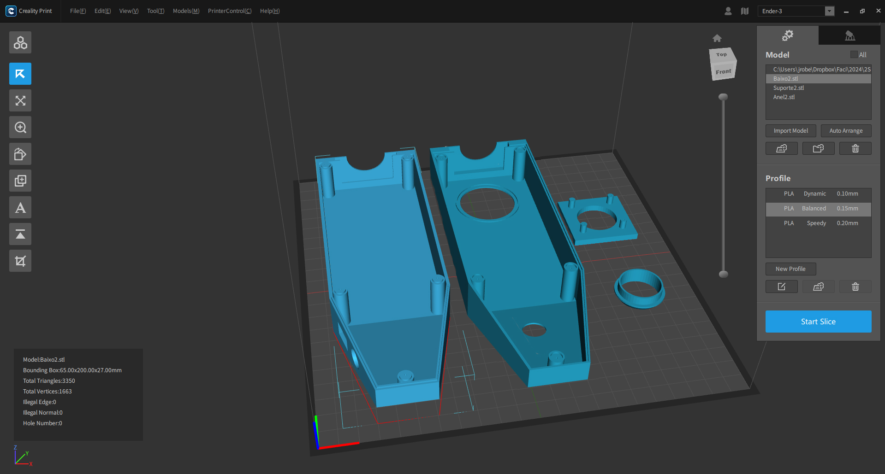
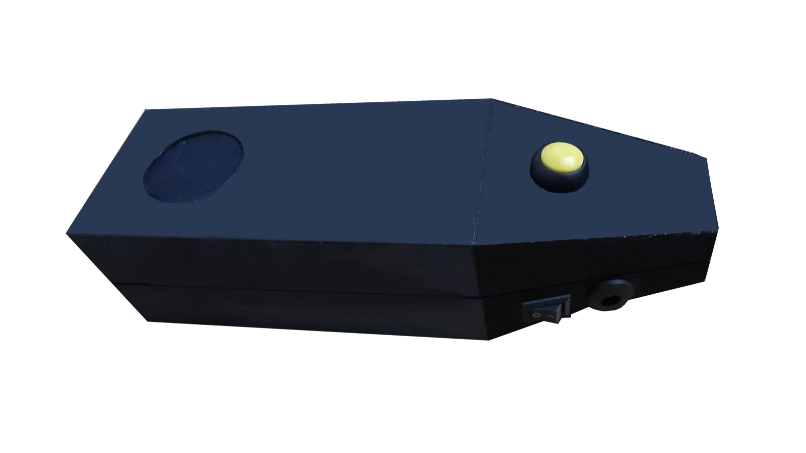

    

  
  

-------

  

# COLORSENSE
Tecnologia Portátil para Identificação de Cores em Roupas para Deficientes Visuais

 > ℹ️ **NOTE:** Este é o repositório desenvolvido durante o projeto de extensão na disciplina de Programação de Microcontroladores no qual fui aluno na plataforma da [Faculdade Faci Wyden](https://www.wyden.com.br/) com o professor [Paulo Tássio da Luz Melo](https://www.linkedin.com/in/paulotassio/).

  

O projeto intitulado “COLORSENSE: Tecnologia Portátil para Identificação de Cores em Roupas para Deficientes Visuais” tem como objetivo utilizar a tecnologia assistiva. Nossa proposta é desenvolver um dispositivo portátil que permita a um deficiente visual identificar a cor das roupas que está usando ou irá usar, utilizando microcontroladores e sensores. Com o apoio da Associação Paraense das Pessoas com Deficiência, esperamos proporcionar ao deficiente visual bem-estar, qualidade de vida e satisfação pessoal ao poder escolher as cores de suas roupas sem o auxílio de outras pessoas e fortalecer o vínculo entre a universidade e a comunidade local.

<a href="#" title="View PDF now"> 📕Clique aqui para ler o artigo</a>

## 💻 Tecnologias utilizadas no projeto

- [Arduino] - para desenvolver o código
- [SketchUp] - para gerar o case em 3D
- [Kiri:Moto](https://grid.space/kiri/) - Para conversão de arquivos .stl para .gcode

## 📄 Gerado na IDE do Arduino

Código：

|   Arquivo   | descrição                                                                                                                                                                                                                                                                         |
| :------: | ------------------------------------------------------------------------------------------------------------------------------------------------------------------------------------------------------------------------------------------------------------------------------ |
|  Q0704_LeitorDeCor_TCS3200.ino  | Este código em C++ usa o sensor de cor TCS230 e o módulo de som DFPlayer Mini para ler a cor detectada e tocar um arquivo de áudio correspondente.

Bibliotecas e Objetos: Inclui as bibliotecas para o sensor de cor, para a contagem de frequência e para o controle de um MP3 player.
Pinos e Componentes: Define os pinos para os componentes (sensor de cor, LED e botão).
Configuração Inicial: No setup(), inicializa o sensor de cor, configura o botão, o LED e chama a função configuraMP3() para ajustar o módulo MP3, incluindo o volume.
Loop Principal:
Ao detectar o pressionamento do botão, o LED acende e o sensor de cor lê a cor.
Após a leitura, exibe os valores RGB e o nome da cor correspondente.
Toca o arquivo de áudio associado, onde cada cor tem um número que corresponde a um arquivo de som numerado na pasta MP3 do DFPlayer Mini.
O LED é desligado após a execução do áudio.
Este código permite identificar cores e tocar um som específico para cada uma, criando uma interação áudio-visual.                                                                                                                                                                                                    |
| conteúdo | VVVVVVVV |

## ✨ Características

- Conteúdo ....
- Imagens ....

## 📚 Materiais

- Arduino UNO;
- Sensor de cor TCS3200;
- Módulo de áudio DFPlayer Mini;
- Cartão SD 8GB;
- Duas baterias de Li-Po (Lítio-Polímero) 3.7V;
- Placa BMS 3S 12V 100A;
- Botão para ligar e desligar o dispositivo;
- Botão push para acionar a leitura do sensor de cor;
- Jump’s de ligação;
- Alto-falante
- parafusos

## 🛠️ Instruções de execução

Utilize os .....

## 👨‍💻 Expert

    
    
&nbsp&nbsp&nbspJosé Roberto Vasconcellos Lopes 
    &nbsp&nbsp&nbsp
    <a href="https://github.com/jrobertovl">GitHub</a>&nbsp;|&nbsp;
    <a href="https://www.linkedin.com/in/jrobertovl">LinkedIn</a>&nbsp;|&nbsp;
    <a href="https://www.instagram.com/jrobertovl/">Instagram</a>&nbsp;|&nbsp;
    <a href="https://api.whatsapp.com/send?phone=5591982003052">WhatsApp</a>
    

  

---

⌨️ com 💜 por [José Roberto Vasconcellos Lopes](https://github.com/jrobertovl)

